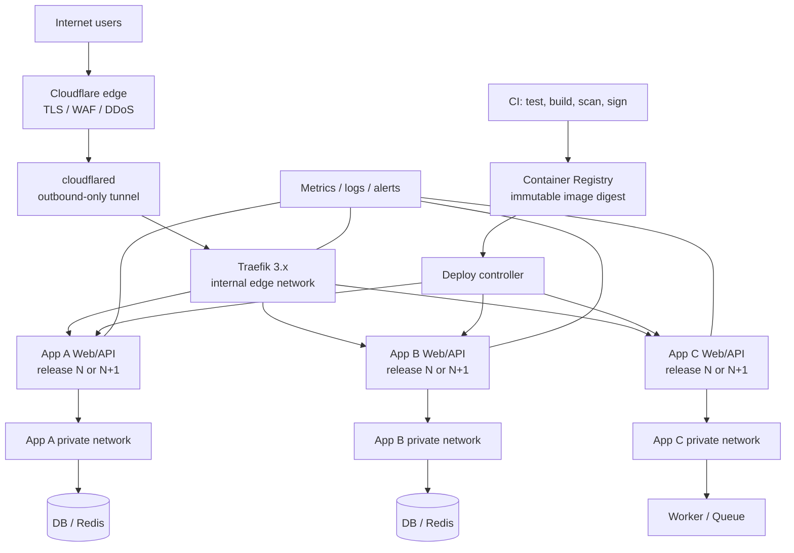

# VPS Deployment System Architecture — Multi-App, Multi-Container, Near-Zero-Downtime

## 1. Executive decision

For a single VPS hosting many applications, where each application may contain multiple containers, the best default architecture is:

> **Docker Engine + Docker Compose + Traefik 3.x + immutable images built in CI + health-gated rolling replacement (`docker-rollout`) + full blue/green only for critical or tightly coupled services + Cloudflare Tunnel at the edge when available.**

This design deliberately does **not** introduce Kubernetes, Nomad, or a full PaaS as the primary orchestration layer on day one. A single VPS cannot provide host-level high availability regardless of orchestrator. The goal should therefore be:

1. near-zero downtime during normal application deploys;
2. a failed build never touches the live release;
3. a failed startup never replaces the healthy live release;
4. fast and deterministic rollback;
5. minimal public attack surface;
6. clear separation between stateless services, stateful data, and singleton workers;
7. a common deployment contract that every repository follows;
8. an easy migration path to a second/third VPS later.

The core principle is **“build once, deploy by immutable digest, overlap releases, health-gate the cutover, drain the old release, and never rebuild production in place.”**

---

## 2. The most important limitation: one VPS is still one failure domain

A single VPS can achieve application-level zero or near-zero downtime during container updates, but it cannot deliver infrastructure HA.

The following events can still take everything down:

- VPS reboot;
- kernel panic;
- physical host failure;
- provider network outage;
- disk corruption;
- Docker daemon failure;
- host firewall misconfiguration;
- a catastrophic resource exhaustion event.

Kubernetes, K3s, Docker Swarm, or Nomad on a single node cannot remove this constraint. They can improve process scheduling and deployment behavior, but the physical failure domain remains one machine.

Therefore, this architecture optimizes **deployment availability**, not fictional single-node infrastructure HA.

---

## 3. Option landscape

### 3.1 Docker Compose only

Docker officially supports Compose as a production model on a single server. The standard `docker compose up` workflow is simple, but recreating a service normally destroys/replaces the existing container. Docker's own production guide documents this recreate behavior.[1]

**Strengths**

- lowest operational complexity;
- current Compose files remain usable;
- good local/production parity;
- easy to debug;
- broad tooling ecosystem.

**Weaknesses**

- vanilla Compose does not provide a first-class rolling deployment controller;
- service replacement can create a downtime window;
- rollback must be implemented by the deployment workflow.

**Verdict:** ideal foundation, but it needs a release layer.

### 3.2 Docker Compose + `docker-rollout`

`docker-rollout` is a Docker CLI plugin specifically designed to add zero-downtime service replacement to Compose. It starts additional containers, waits for health checks, then removes the old containers. Current versions also support pre-stop hooks for request draining.[7]

Key caveats are important:

- rollout services must not hard-code `container_name`;
- rollout services must not bind a fixed host port;
- traffic should enter through a reverse proxy such as Traefik;
- real health checks are mandatory for safe deployment;
- draining is required if dropping in-flight requests is unacceptable.

**Verdict:** best default deployment mechanism for stateless HTTP/API containers on one VPS.

### 3.3 Docker Swarm

Docker Swarm provides built-in service discovery, encrypted node communication, rolling updates, service rollback, replicas, and encrypted Swarm secrets.[3][4][18]

It also supports `update_config.order: start-first` and rollback behavior in the Compose Deploy specification.[2]

However, there are trade-offs for this use case:

- `docker stack deploy` does not build images; Docker documents that `build` is ignored, so images must already exist in a registry.[19]
- some Compose features differ or are unsupported in Stack mode;
- a one-node Swarm does not improve host availability;
- official Swarm service-update documentation describes progression based on the replacement task becoming `RUNNING`, rather than defining application readiness as the cutover contract.[4]
- SwarmKit still has open edge-case issues around update/stop behavior, making careful testing necessary for singleton or long-draining services.

**Verdict:** a valid second choice, especially if multi-node Docker is likely soon, but not required merely to get safe deployments on one VPS.

### 3.4 Kamal

Kamal is a low-overhead deployment tool that deploys Docker images over SSH. Its current deployment process starts a new container, waits for a successful health endpoint, switches `kamal-proxy`, and then stops the old container.[8]

This is elegant for app-centric deployments and has a very small persistent control-plane footprint.

**Weakness for this environment:** an existing estate composed of many arbitrary multi-container Compose stacks does not map as directly to Kamal's app/role/accessory model as it does to Compose.

**Verdict:** excellent for individual web applications; less ideal as the universal standard for an existing Compose-heavy VPS.

### 3.5 Nomad

Nomad has first-class rolling, canary, auto-revert, and blue/green deployment semantics. Its `update` block supports health checks, `min_healthy_time`, deadlines, canaries, automatic promotion, and automatic revert.[11][12]

**Strengths**

- much more deliberate deployment controller than Compose;
- simpler conceptual model than Kubernetes;
- good multi-node future.

**Costs**

- migrate from Compose to Nomad job specifications;
- introduce Nomad server/client control plane;
- often add service discovery/load-balancing integrations;
- still no infrastructure HA with one node.

**Verdict:** strong when the environment grows beyond one host, not the best first move for this constraint set.

### 3.6 K3s / Kubernetes

Kubernetes Deployments support rolling updates and rollback as first-class primitives.[10] K3s packages Kubernetes for smaller environments, but current K3s requirements list a 2-core/2-GB baseline for a server node, and current profiling shows roughly 1.6 GB minimum RAM for a single K3s server sharing the node with a workload.[9]

Kubernetes provides excellent primitives—Deployments, readiness probes, startup probes, Jobs, Secrets, NetworkPolicy integrations, ingress/Gateway API—but on a single VPS these capabilities come with control-plane, networking, storage, and operational overhead without eliminating the one-node failure domain.

**Verdict:** use when Kubernetes itself is a strategic requirement or when moving to several nodes. Do not adopt it solely for zero-downtime deployments on one VPS.

### 3.7 Coolify

Coolify is a good PaaS/control-plane experience and defaults to Traefik. Its documentation now explicitly states that application-level rolling updates are **not supported for Docker Compose applications**; they apply to its single-image/Dockerfile-style application deployment flow.[13]

**Verdict:** useful for UI-driven app management, but not the best core solution if raw Compose portability plus zero-downtime Compose deployment are primary requirements.

### 3.8 Dokploy

Dokploy supports both Docker Compose and Docker Stack/Swarm modes. Its official documentation includes zero-downtime deployment settings and health-route requirements, and its Compose documentation distinguishes normal Compose from Stack mode.[14]

**Verdict:** the most interesting PaaS-style alternative if a web UI is desired and adopting its deployment model is acceptable. For maximum transparency and portability, the proposed custom Compose/Traefik release system is still simpler.

---

## 4. Decision matrix

The scoring below is an architectural judgment for the specific goal: **one VPS, many apps, many containers, low downtime, high security, low operational weight**.

| Approach | Single-VPS fit | Compose compatibility | Deploy safety | Rollback | Operational weight | Future multi-node | Overall fit |
|---|---:|---:|---:|---:|---:|---:|---:|
| Compose + Traefik + docker-rollout | 10 | 10 | 9 | 9 | 9 | 6 | **9.2** |
| Compose + custom full blue/green | 9 | 9 | 10 | 10 | 7 | 6 | **8.8** |
| Docker Swarm + Traefik | 8 | 7 | 8 | 9 | 8 | 9 | **8.2** |
| Kamal | 9 | 5 | 9 | 9 | 9 | 8 | **8.1** |
| Dokploy | 8 | 8 | 8 | 8 | 6 | 8 | **7.7** |
| Nomad | 6 | 3 | 10 | 10 | 6 | 10 | **7.3** |
| Coolify + raw Compose | 8 | 9 | 5 | 7 | 6 | 5 | **6.8** |
| K3s | 4 | 2 | 10 | 10 | 3 | 10 | **6.5** |

The key result is that the technically most powerful orchestrator is not automatically the best system for a single box.

---

## 5. Recommended system architecture



### Architectural layers

#### Layer A — Edge

- Cloudflare DNS/TLS/WAF where applicable;
- Cloudflare Tunnel for outbound-only origin connectivity;
- Traefik as the single internal HTTP routing plane.

Cloudflare documents Tunnel as outbound-only and states that ingress traffic can be blocked entirely while `cloudflared` is allowed to establish outbound connections.[15][16]

#### Layer B — Runtime

- standard Docker Engine;
- standard Compose per application;
- external shared `edge` network only for containers that must receive traffic from Traefik;
- app-private networks for databases, queues, Redis, and internal services.

#### Layer C — Release controller

- CI builds images;
- registry stores immutable images;
- deployment process pulls by immutable tag/digest;
- stateless HTTP services use health-gated rollout;
- critical coupled releases use blue/green slots;
- stateful/singleton services use special handoff rules.

#### Layer D — Data

- databases are not duplicated during routine app release;
- persistent volumes remain independent of app release containers;
- migrations are backwards-compatible and run as explicit release steps;
- backups are off-host and restore-tested.

#### Layer E — Operations

- metrics;
- structured logs;
- uptime checks;
- release history;
- backup verification;
- security scanning.

---

## 6. Standardized “deployment design system” for every repository

The largest long-term benefit comes from standardization. Every repository should implement the same contract.

Recommended repository layout:

```text
repo/
├── Dockerfile
├── compose.yaml
├── compose.production.yaml
├── deploy/
│   ├── release.yaml
│   ├── smoke.sh
│   ├── migrate.sh
│   └── rollback.sh
├── scripts/
│   └── healthcheck.sh
└── .github/
    └── workflows/
        ├── ci.yml
        └── production.yml
```

The VPS itself should have a separate platform repository:

```text
vps-platform/
├── edge/
│   ├── compose.yaml
│   ├── traefik.yaml
│   └── dynamic/
├── deploy/
│   ├── deploy.sh
│   ├── rollout.sh
│   ├── blue-green.sh
│   ├── rollback.sh
│   └── release-lock.sh
├── observability/
├── backup/
├── security/
├── templates/
│   ├── compose-web.yaml
│   ├── compose-worker.yaml
│   └── release.yaml
└── apps/
    ├── app-a.env
    ├── app-b.env
    └── app-c.env
```

The **platform repository**, not an admin dashboard, should be the canonical infrastructure source of truth.

---

## 7. Release classes: not every container should deploy the same way

A common mistake is forcing one rollout method onto every workload.

### Class A — Stateless web/API

Examples: React/Next frontend, REST API, web backend, webhook receiver.

**Default strategy:** rolling overlap with `docker-rollout`.

Contract:

- no fixed `container_name`;
- no fixed public `ports:` mapping;
- reachable through Traefik;
- readiness endpoint required;
- graceful SIGTERM handling required;
- state stored outside the container;
- two versions may coexist briefly.

### Class B — Critical tightly coupled release

Examples: frontend and API must switch together, protocol-breaking releases, high-risk production change.

**Strategy:** full blue/green application slot.

Flow:

1. active slot = blue;
2. deploy green with new image digests;
3. wait for every required service to become ready;
4. run internal smoke tests;
5. optionally send a small canary percentage to green;
6. switch Traefik route to green;
7. run public smoke tests;
8. keep blue warm for a rollback window;
9. drain and stop blue later.

Traefik supports weighted service routing and health checks via dynamic configuration, making 1/99, 10/90, 50/50, and 100/0 transitions possible when canary deployment is desired.[6]

### Class C — Idempotent queue worker

If duplicate workers are safe:

- start the new worker;
- let it reach ready;
- stop the old worker;
- use queue acknowledgment and idempotency keys.

### Class D — Singleton worker / session owner / poller

If two active instances would cause duplicate work or session conflicts, do **not** blindly run start-first.

Use a lease/handoff protocol:

1. new container starts in standby mode;
2. it warms dependencies and validates credentials/session availability;
3. old container enters drain mode and stops acquiring new work;
4. old container releases a Redis/DB lease;
5. new container atomically acquires the lease;
6. new container becomes active;
7. old container exits.

For browser-session-style workloads, an even safer design is to separate the long-lived browser/session container from the replaceable polling/business-logic container. Application deploys then do not destroy the browser session.

### Class E — Database

Databases do not use ordinary blue/green app deployment.

Use:

- persistent volumes;
- explicit upgrade procedures;
- backups before version upgrades;
- maintenance windows where appropriate;
- replication only when there is actually another host/failure domain.

---

## 8. The production deployment flow

The recommended pipeline is deliberately split into **build** and **release**.

### Phase 1 — CI validation

Run outside production:

1. lint;
2. unit tests;
3. integration tests;
4. Dockerfile/Compose validation;
5. dependency vulnerability scan;
6. secret scan;
7. build image;
8. produce SBOM/provenance;
9. push image tagged with the exact Git SHA;
10. record immutable digest.

Docker Compose/BuildKit currently supports SBOM and provenance build options, and GitHub supports artifact attestations for build provenance.[20][21]

### Phase 2 — pre-deployment

On the VPS:

1. acquire an app-specific deployment lock (`flock` or equivalent);
2. check free disk;
3. check free memory;
4. validate the Compose config;
5. authenticate to registry using read-only credentials;
6. pull the exact release digest;
7. do not touch the active release yet.

This solves a key production rule:

> **Build failure, test failure, registry failure, or image pull failure must leave the currently running release untouched.**

### Phase 3 — migration

If a schema change exists:

1. take/verify the required backup;
2. run an expand-compatible migration;
3. migration must be safe for both release N and release N+1;
4. never remove a column/table that release N still needs during the same cutover.

### Phase 4 — replacement

For a stateless service:

1. start release N+1 alongside N;
2. wait for Docker health status to become healthy;
3. Traefik discovers the healthy replacement;
4. run internal smoke test;
5. put N into drain mode;
6. stop sending new requests to N;
7. wait for in-flight requests;
8. stop N.

### Phase 5 — post-deployment verification

Check the real production hostname:

- HTTP status;
- API critical route;
- dependency connectivity;
- authentication flow if feasible;
- error rate;
- latency regression;
- queue health;
- log exceptions.

### Phase 6 — release recording

Store:

```yaml
release_id: 2026-09-13T08:00:00Z-a1b2c3d
commit: a1b2c3d
images:
  api: ghcr.io/org/api@sha256:...
  web: ghcr.io/org/web@sha256:...
previous_release: ...
migration: 2026091301
status: healthy
```

Rollback should always target a known previous digest rather than an ambiguous mutable `latest` tag.

---

## 9. Health model: liveness is not readiness

A container being `running` is not proof that it can accept production traffic.

Recommended application endpoints:

### `/health/live`

Proves only that the process/event loop is alive.

Do not make liveness depend on every downstream service; otherwise a database outage can cause Docker to restart every API container simultaneously.

### `/health/ready`

Used for deployment gating and traffic routing.

It should validate the minimum dependencies required to serve requests, for example:

- DB connection is usable;
- required configuration loaded;
- migrations compatible;
- required cache/client initialization complete.

### Docker healthcheck example

```yaml
healthcheck:
  test: ["CMD", "curl", "-fsS", "http://127.0.0.1:3000/health/ready"]
  interval: 10s
  timeout: 3s
  retries: 3
  start_period: 30s
```

Traefik can also perform active backend HTTP health checks and remove unhealthy servers from its load-balancing rotation.[6]

---

## 10. Request draining and graceful shutdown

“New container healthy before old container stops” is not enough for true zero dropped requests.

The old container can still be processing:

- an HTTP upload;
- a long REST request;
- an SSE stream;
- a WebSocket session;
- a queue job.

Recommended sequence:

```text
new healthy
   ↓
old marked draining
   ↓
proxy stops sending NEW traffic to old
   ↓
wait grace period / active requests
   ↓
SIGTERM old
   ↓
application finishes remaining work
   ↓
exit
```

`docker-rollout` supports a pre-stop hook specifically for this style of draining.[7]

For WebSocket/SSE clients, also implement reconnect logic. A single-container process eventually has to terminate, so durable clients should reconnect automatically and, for SSE, use event IDs where applicable.

---

## 11. Database migration model: Expand → Migrate → Contract

Database migrations are one of the biggest hidden causes of failed zero-downtime deployments.

### Release N

Uses `old_column`.

### Step A — Expand

Add `new_column` without deleting `old_column`.

Both N and N+1 remain compatible.

### Step B — Deploy N+1

N+1 can read/write both formats or prefer the new format.

### Step C — Backfill

Migrate existing data asynchronously.

### Step D — Contract

Only in a later release, after N can no longer be running, remove `old_column`.

Never bundle an immediately breaking schema change with a blue/green or rolling app deployment.

---

## 12. Traefik is the recommended reverse proxy for this design

Caddy is an excellent general reverse proxy, but Traefik fits this particular system more naturally because it has a first-party Docker provider and dynamically discovers container/service configuration from labels.[5]

Traefik advantages here:

- Docker event-driven discovery;
- no per-release static upstream IP management;
- health-aware service membership;
- weighted services for canary/blue-green;
- middlewares;
- access logs/metrics/tracing integration;
- easy per-container routing labels;
- no proxy reload for ordinary container replacement.

Use:

```yaml
providers:
  docker:
    exposedByDefault: false
```

Traefik explicitly documents that unrestricted Docker API access is security-sensitive.[5]

Do **not** expose the insecure Traefik dashboard publicly.

---

## 13. Secure Docker API access

Mounting `/var/run/docker.sock` directly inside Traefik effectively places a highly privileged host-control interface inside that container.

Traefik's own documentation warns that unrestricted Docker API access is a security concern and explicitly lists filtered Docker socket proxies as a mitigation.[5]

Recommended topology:

```text
Docker socket
   ↓
restricted socket proxy
   ↓ private network
Traefik read-only discovery
```

The proxy itself must not be exposed publicly.

An alternative is Docker's rootless mode, which runs the daemon and containers without root privileges, but this should be tested against the complete workload set before becoming the platform default.[17]

---

## 14. Network design

### Shared edge network

Create one external network:

```text
edge
```

Members:

- Traefik;
- cloudflared;
- only the frontend/API container of each application that needs inbound HTTP traffic.

### Private app networks

Each app gets its own private network:

```text
app_a_private
app_b_private
app_c_private
```

DB, Redis, queues, internal browser automation, and workers stay on these networks.

### Critical rule: avoid host-published app ports

Docker documents that published ports are externally reachable by default, and that Docker port publishing can bypass normal UFW expectations.[22][23]

Therefore:

- do not publish DB ports;
- do not publish Redis ports;
- do not publish internal API ports;
- do not map every app to `3001`, `3002`, `3003`, etc.;
- let Traefik connect to containers over Docker networks.

If Cloudflare Tunnel is the only public ingress, Traefik itself does not need a publicly published `80/443` port.

---

## 15. Cloudflare Tunnel edge model

Cloudflare currently documents Tunnel as an outbound-only connection where no public origin IP or inbound port is required. A `cloudflared` process maintains multiple long-lived connections to Cloudflare for connection-level redundancy.[15]

Recommended path:

```text
Internet
→ Cloudflare
→ Cloudflare Tunnel
→ cloudflared container
→ Traefik on `edge`
→ target app container
```

Benefits:

- origin does not need public web ports;
- direct-origin bypass becomes much harder;
- DDoS/WAF/CDN remain at Cloudflare;
- administration panels can be placed behind Cloudflare Access;
- only outbound tunnel connectivity is required.

Cloudflare also documents a positive-security firewall model that blocks all ingress and permits only required tunnel egress.[16]

A second `cloudflared` process on the **same VPS** improves process-level redundancy but still cannot survive the VPS itself failing. Real host-level tunnel HA requires another host/failure domain.

---

## 16. Container hardening baseline

Apply these where compatible:

```yaml
security_opt:
  - no-new-privileges:true

cap_drop:
  - ALL

read_only: true

tmpfs:
  - /tmp

pids_limit: 256

restart: unless-stopped

stop_grace_period: 30s
```

Also:

- run as a non-root UID inside the image;
- add only the Linux capabilities actually needed;
- never use `privileged: true` unless there is a proven requirement;
- avoid `network_mode: host`;
- avoid mounting `/` or broad host directories;
- pin base images deliberately;
- use multi-stage builds;
- keep production images minimal.

Docker documents `no-new-privileges` as a control that prevents processes from gaining additional privileges.[24]

---

## 17. Secrets

Do not commit production secrets to Git and do not bake them into container images.

### Compose baseline

Use one of:

- host-side secret files with strict permissions mounted read-only;
- SOPS/age-encrypted secret files decrypted only during deployment;
- an external secret manager if operationally justified.

Environment variables are convenient but are easier to expose through process/container inspection than file-mounted secrets.

### If Swarm is adopted later

Docker Swarm secrets are encrypted in transit and at rest in the encrypted Raft log and are mounted only to authorized running services.[18]

---

## 18. CI/CD supply-chain controls

Minimum production pipeline:

```text
commit
→ tests
→ dependency scan
→ secret scan
→ build
→ container scan
→ SBOM
→ provenance/signature
→ push immutable image
→ deployment approval/policy
→ pull exact digest
→ deploy
```

Recommended rules:

- never deploy `latest` as the source of truth;
- tag with Git SHA;
- record digest;
- use a read-only registry credential on the VPS;
- pin CI actions to trusted versions/SHAs where appropriate;
- scan image before release;
- reject Critical vulnerabilities according to an explicit exception policy;
- optionally verify Sigstore/Cosign signatures before deployment.[25]

---

## 19. Resource protection on one VPS

Zero-downtime deployments temporarily run old and new containers simultaneously. Therefore memory headroom is part of the deployment design.

### Rule of thumb

Do not start an overlap deployment unless:

```text
available RAM > new service expected peak + safety reserve
```

For each service define:

- memory limit;
- CPU limit where appropriate;
- PID limit;
- maximum log growth;
- Docker healthcheck cost.

Suggested reserve:

- keep at least 15–25% RAM uncommitted under normal steady state;
- maintain enough free disk for at least one additional release image plus rollback image;
- never build large application images on the production VPS if CI can do it elsewhere.

Building in CI is especially important: application compilation can consume CPU/RAM aggressively and degrade the currently running production containers even if the deployment itself is perfectly zero-downtime.

---

## 20. Observability design

A deployment system is incomplete if it cannot tell whether a release is actually healthy.

### Required signals

#### Host

- CPU;
- RAM;
- swap;
- disk usage;
- disk I/O;
- load average;
- Docker daemon status.

#### Per container

- CPU;
- memory;
- restart count;
- health state;
- network I/O;
- log error rate.

#### Per application

- request rate;
- p50/p95/p99 latency;
- 4xx/5xx;
- queue lag;
- DB connection saturation;
- business-critical errors.

#### Release

- currently active release ID;
- previous release ID;
- deploy duration;
- failed health gates;
- rollback count.

### Lightweight approach

For a one-VPS environment, choose a monitoring stack whose cost is smaller than the apps being monitored. A minimal Prometheus-compatible metrics store + Grafana, or a lighter all-in-one host/container monitor, is usually more appropriate than a large enterprise observability stack.

Application exceptions should also be sent to an external error-tracking system where feasible, because a monitoring system running on the same failed VPS cannot alert when the whole VPS is gone.

---

## 21. Backup architecture

Zero downtime does not protect data.

### Database

- scheduled logical backups;
- periodic physical/base backup if appropriate for the database;
- offsite copy;
- retention policy;
- encryption;
- restore test.

### Volumes

Only back up volumes that actually contain persistent state. Do not waste backup capacity on reproducible containers/images.

### Release metadata

Back up:

- Compose definitions;
- Traefik dynamic config;
- encrypted secrets;
- release manifests;
- database migration history.

### Most important rule

A backup that has never been restored is only a hypothesis.

Schedule restore drills.

---

## 22. Rollback model

There are two rollback speeds.

### Fast rollback — blue/green

Old release is still alive.

```text
Traefik → green
problem detected
Traefik → blue
```

This is the safest approach for critical web/API paths.

### Re-deploy rollback — rolling release

Old container is already gone but previous image digest is known.

```text
release N+1 bad
→ docker rollout previous digest N
```

This is slower than a live-slot switch but remains deterministic.

### Migration constraint

Rollback is only safe if the database schema is backwards compatible. That is why expand/contract migration is part of the deployment architecture rather than merely a database concern.

---

## 23. Canary deployment

Canary is useful only when there are enough requests and enough observability to tell whether the canary is actually better or worse.

For a single VPS:

```text
95% → blue
 5% → green
```

Then:

```text
80/20 → 50/50 → 0/100
```

Traefik supports weighted services for this model.[6]

Do not add canary complexity to low-traffic internal services where there is no meaningful statistical signal. For those services, health-gated blue/green is simpler and safer.

---

## 24. Recommended application Compose pattern

Illustrative production service:

```yaml
services:
  api:
    image: ${API_IMAGE}
    restart: unless-stopped
    init: true
    stop_grace_period: 30s

    networks:
      - edge
      - private

    expose:
      - "3000"

    healthcheck:
      test: ["CMD", "curl", "-fsS", "http://127.0.0.1:3000/health/ready"]
      interval: 10s
      timeout: 3s
      retries: 3
      start_period: 30s

    security_opt:
      - no-new-privileges:true

    cap_drop:
      - ALL

    pids_limit: 256

    labels:
      - traefik.enable=true
      - traefik.docker.network=edge
      - traefik.http.routers.myapp.rule=Host(`app.example.com`)
      - traefik.http.routers.myapp.service=myapp
      - traefik.http.services.myapp.loadbalancer.server.port=3000
      - docker-rollout.pre-stop-hook=touch /tmp/drain && sleep 15

  db:
    image: postgres:18
    restart: unless-stopped
    networks:
      - private
    volumes:
      - db_data:/var/lib/postgresql/data
    # No public ports.

networks:
  edge:
    external: true
  private:
    internal: true

volumes:
  db_data:
```

For a drain-file design, `/health/ready` should fail when `/tmp/drain` exists.

---

## 25. Deployment pseudocode

```bash
set -euo pipefail

# 1. Serialize deployments per app.
flock /var/lock/deploy-myapp.lock true

# 2. Validate release metadata and Compose config.
docker compose -f compose.yaml -f compose.production.yaml config -q

# 3. Pull immutable release images.
docker compose -f compose.yaml -f compose.production.yaml pull api

# 4. Run backwards-compatible migration.
docker compose run --rm migrate

# 5. Replace web/API without downtime.
docker rollout \
  -f compose.yaml \
  -f compose.production.yaml \
  --timeout 120 \
  --wait-after-healthy 5 \
  api

# 6. Verify real route.
curl -fsS https://app.example.com/health/ready

# 7. Record release manifest.
```

Production implementation should also handle failed smoke tests and redeploy the previous immutable digest automatically when policy allows.

---

## 26. Multi-service deployment policy

Suppose an app contains:

```text
web
api
worker
scheduler
redis
postgres
```

Do not run one destructive `docker compose up -d --build` over the whole stack.

Use:

| Service | Release policy |
|---|---|
| `web` | rolling or blue/green |
| `api` | rolling or blue/green |
| `worker` | rolling if idempotent; handoff otherwise |
| `scheduler` | singleton lease/handoff |
| `redis` | persistent dependency; update separately |
| `postgres` | persistent dependency; maintenance/upgrade procedure |

This separation prevents an ordinary UI/API deployment from restarting the entire database/session/worker layer.

---

## 27. Admin/control panel policy

A web management panel can be useful, but it should **not** become an uncontrolled second source of truth.

Recommended rule:

> Git + CI defines desired application releases; the panel is for observation, emergency action, logs, resource usage, and controlled operations.

Avoid casually editing production Compose definitions only in a UI.

Any control panel capable of creating containers is effectively infrastructure-admin access because Docker daemon control can lead to host control.[5][26]

Therefore:

- put the panel behind Cloudflare Access or another strong identity gate;
- require MFA;
- do not expose its raw port publicly;
- restrict who can access it;
- keep audit logs where possible;
- back up its state;
- keep it patched.

---

## 28. Anti-patterns to avoid

### Anti-pattern 1 — Build directly on production and immediately replace

```text
git pull
→ docker compose up -d --build
```

Problem: a build can consume production resources and a bad replacement can immediately affect live traffic.

### Anti-pattern 2 — `latest` everywhere

A rollback must know exactly which image was previously running.

### Anti-pattern 3 — fixed public port for every app

This makes overlapping releases difficult and expands the attack surface.

### Anti-pattern 4 — `container_name` on rollout services

Two release instances cannot coexist with the same name.

### Anti-pattern 5 — health endpoint always returns 200

A meaningless health check makes deployment automation confidently wrong.

### Anti-pattern 6 — destructive DB migration during cutover

This can make both forward deployment and rollback fail.

### Anti-pattern 7 — deploy every container in the Compose project every time

Updating `web` should not restart PostgreSQL, Redis, browser session containers, or unrelated workers.

### Anti-pattern 8 — direct Docker socket exposure

Do not expose Docker API publicly and avoid broad direct socket mounts where filtered access is possible.

### Anti-pattern 9 — believing replicas on one VPS equal HA

Two containers on one VPS protect against a process/container failure, not against host failure.

---

## 29. Migration plan

### Phase 0 — Inventory

For every current container classify:

- public stateless;
- internal stateless;
- idempotent worker;
- singleton worker;
- stateful database/cache;
- session owner;
- infrastructure service.

Record:

- image/build path;
- port;
- volume;
- network;
- health check;
- startup time;
- graceful shutdown behavior;
- dependencies;
- whether two copies can safely run together.

### Phase 1 — Edge standardization

Deploy:

- Traefik;
- restricted Docker socket proxy;
- one external `edge` network;
- Cloudflare Tunnel when used;
- protected admin endpoints.

Migrate apps one by one from host ports to Traefik labels.

### Phase 2 — CI image standardization

For every app:

- build in CI;
- push SHA-tagged image;
- add vulnerability scanning;
- add SBOM/provenance;
- deploy by digest/tag resolved to a digest.

### Phase 3 — health and graceful shutdown

Every stateless app must implement:

- readiness endpoint;
- Docker healthcheck;
- SIGTERM handling;
- `stop_grace_period`;
- externalized sessions/state.

### Phase 4 — rolling deployment

Introduce `docker-rollout` for suitable services.

Load-test deployment while repeatedly requesting the application and prove that request failures remain zero or within the agreed SLO.

### Phase 5 — critical blue/green

Implement full blue/green only for Tier-1 applications or releases whose components must switch atomically.

### Phase 6 — observability and automatic rollback

Only after metrics are trustworthy should automatic rollback based on error rate/latency become enabled.

---

## 30. When to move beyond this architecture

### Move to single-node Swarm when

- Swarm service semantics are desired across nearly all apps;
- encrypted Swarm secrets are valuable;
- a second Docker host is likely soon;
- the team accepts Stack-mode differences from Compose.

### Move to Nomad when

- there are multiple VPS nodes;
- scheduled workloads and service placement matter;
- canary/blue-green are required as orchestrator-native primitives;
- Compose compatibility is no longer a top requirement.

### Move to K3s/Kubernetes when

- Kubernetes ecosystem compatibility is itself a requirement;
- there are several nodes or a clear near-term path to them;
- operators are comfortable with CNI, CSI, ingress/Gateway API, RBAC, CRDs, and cluster lifecycle;
- the workload count/team size justifies a real orchestration control plane.

Do not migrate because Kubernetes is fashionable. Migrate when the limitations of the current platform are measurable.

---

## 31. Final recommended stack

### Core

- Docker Engine
- Docker Compose v2
- Traefik 3.x
- `docker-rollout` pinned to a reviewed version

### Edge

- Cloudflare DNS
- Cloudflare Tunnel when appropriate
- Cloudflare WAF/DDoS controls
- Cloudflare Access for private/admin surfaces

### Registry / CI

- GitHub Actions or equivalent CI
- GHCR or another OCI registry
- immutable SHA tags + image digests
- SBOM/provenance
- container vulnerability scan
- optional Cosign verification

### Runtime architecture

- `edge` network
- one private network per app
- no public ports for internal containers
- app state outside replaceable containers
- service-specific deployment strategy

### Availability mechanisms

- Docker health checks
- Traefik health-aware routing
- rolling overlap for normal stateless services
- request draining
- full blue/green for Tier-1/coupled changes
- lease handoff for singleton workers
- expand/contract DB migrations

### Operations

- app-specific deploy locks
- recorded release manifests
- automatic disk/image cleanup policy that never deletes current/rollback images
- metrics/logs/error tracking
- offsite backups
- restore drills

---

## 32. The shortest possible recommendation

If only one architecture is implemented, implement this:

```text
Git push
  ↓
CI: test + build + scan
  ↓
push immutable image to registry
  ↓
VPS pre-pulls image
  ↓
start new container alongside old
  ↓
wait until /health/ready is truly healthy
  ↓
Traefik sends traffic to healthy new instance
  ↓
drain old instance
  ↓
stop old instance
  ↓
smoke test public domain
  ↓
record release + keep previous digest for rollback
```

For a one-VPS, many-Compose-app environment, this provides most of the production reliability benefit of a large orchestrator while preserving simplicity, portability, and low resource overhead.

---

# Sources

1. Docker Docs — **Use Compose in production**: https://docs.docker.com/compose/how-tos/production/
2. Docker Docs — **Compose Deploy Specification**: https://docs.docker.com/reference/compose-file/deploy/
3. Docker Docs — **Swarm mode**: https://docs.docker.com/engine/swarm/
4. Docker Docs — **Deploy services to a swarm**: https://docs.docker.com/engine/swarm/services/
5. Traefik Docs — **Docker Provider / Docker API Access**: https://doc.traefik.io/traefik/master/reference/install-configuration/providers/docker/
6. Traefik Docs — **HTTP Services / load balancing, weighted services and health checks**: https://doc.traefik.io/traefik/reference/routing-configuration/http/load-balancing/service/
7. `docker-rollout` — **Zero Downtime Deployment for Docker Compose**: https://github.com/wowu/docker-rollout
8. Kamal Docs — **Deploy / gapless deployment flow**: https://kamal-deploy.org/docs/commands/deploy/
9. K3s Docs — **Requirements / Resource Profiling**: https://docs.k3s.io/installation/requirements and https://docs.k3s.io/reference/resource-profiling
10. Kubernetes Docs — **Update a Deployment Without Downtime**: https://kubernetes.io/docs/tasks/run-application/update-deployment-rolling/
11. Nomad Docs — **Blue-green and canary deployments**: https://developer.hashicorp.com/nomad/docs/job-declare/strategy/blue-green-canary
12. Nomad Docs — **Update block**: https://developer.hashicorp.com/nomad/docs/job-specification/update
13. Coolify Docs — **Rolling Updates**: https://coolify.io/docs/applications/deployments/rolling-updates
14. Dokploy Docs — **Zero Downtime** and **Docker Compose**: https://docs.dokploy.com/docs/core/applications/zero-downtime and https://docs.dokploy.com/docs/core/docker-compose
15. Cloudflare Docs — **Cloudflare Tunnel**: https://developers.cloudflare.com/tunnel/
16. Cloudflare Docs — **Tunnel with firewall**: https://developers.cloudflare.com/cloudflare-one/networks/connectors/cloudflare-tunnel/configure-tunnels/tunnel-with-firewall/
17. Docker Docs — **Rootless mode**: https://docs.docker.com/engine/security/rootless/
18. Docker Docs — **Manage sensitive data with Docker secrets**: https://docs.docker.com/engine/swarm/secrets/
19. Docker Docs — **Deploy a stack to a swarm**: https://docs.docker.com/engine/swarm/stack-deploy/
20. Docker Docs — **Compose Build Specification / SBOM / provenance**: https://docs.docker.com/reference/compose-file/build/
21. GitHub Docs — **Artifact attestations**: https://docs.github.com/en/actions/how-tos/secure-your-work/use-artifact-attestations/use-artifact-attestations
22. Docker Docs — **Packet filtering and firewalls**: https://docs.docker.com/engine/network/packet-filtering-firewalls/
23. Docker Docs — **Port publishing and mapping**: https://docs.docker.com/engine/network/port-publishing/
24. Docker Docs — **docker container run / no-new-privileges**: https://docs.docker.com/reference/cli/docker/container/run
25. Sigstore Docs — **Verifying container signatures with Cosign**: https://docs.sigstore.dev/cosign/verifying/verify/
26. Docker Docs — **Docker Engine security / daemon attack surface**: https://docs.docker.com/engine/security/
